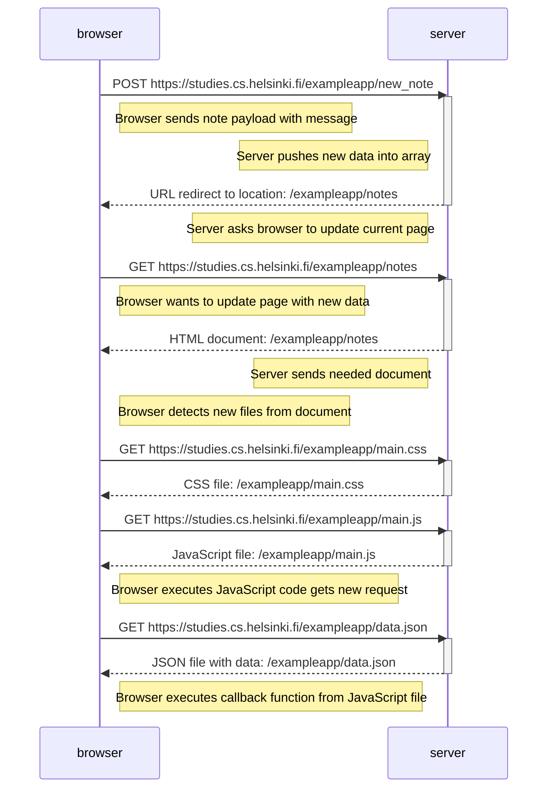

```mermaid

sequenceDiagram
    participant browser
    participant server

    browser->>server: POST https://studies.cs.helsinki.fi/exampleapp/new_note
    activate server
    Note right of browser: Browser sends note payload with message
    Note left of server: Server pushes new data into array
    server-->>browser: URL redirect to location: /exampleapp/notes
    deactivate server
    Note left of server: Server asks browser to update current page

    browser->>server: GET https://studies.cs.helsinki.fi/exampleapp/notes
    activate server
    Note right of browser: Browser wants to update page with new data
    server-->>browser: HTML document: /exampleapp/notes
    deactivate server
    Note left of server: Server sends needed document
    
    Note right of browser: Browser detects new files from document
    browser->>server: GET https://studies.cs.helsinki.fi/exampleapp/main.css
    activate server
    server-->>browser: CSS file: /exampleapp/main.css
    deactivate server

    browser->>server: GET https://studies.cs.helsinki.fi/exampleapp/main.js
    activate server
    server-->>browser: JavaScript file: /exampleapp/main.js
    deactivate server

    Note right of browser: Browser executes JavaScript code gets new request
    browser->>server: GET https://studies.cs.helsinki.fi/exampleapp/data.json
    activate server
    server-->>browser: JSON file with data: /exampleapp/data.json
    deactivate server

    Note right of browser: Browser executes callback function from JavaScript file

```