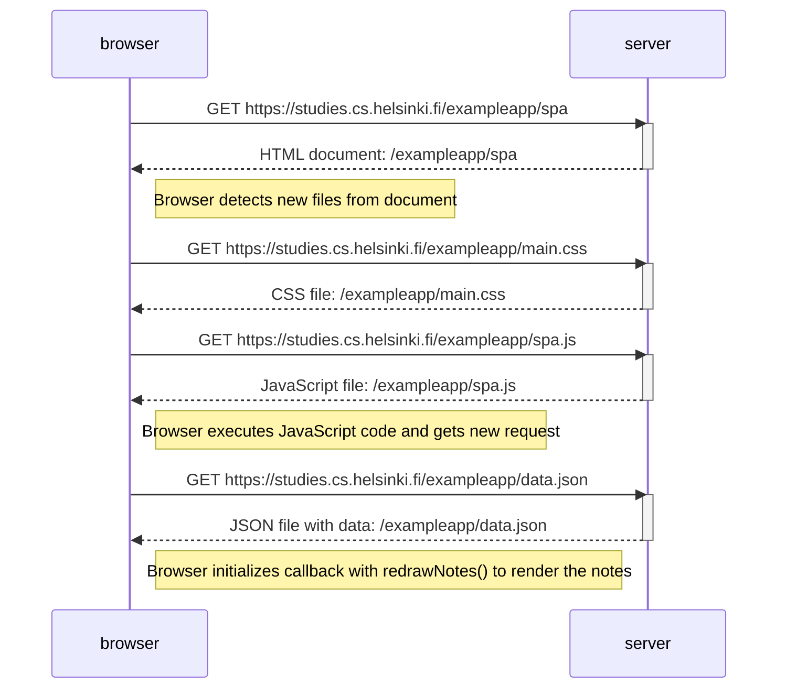

```mermaid

sequenceDiagram
    participant browser
    participant server

    browser->>server: GET https://studies.cs.helsinki.fi/exampleapp/spa
    activate server
    server-->>browser: HTML document: /exampleapp/spa
    deactivate server

    Note right of browser: Browser detects new files from document
    browser->>server: GET https://studies.cs.helsinki.fi/exampleapp/main.css
    activate server
    server-->>browser: CSS file: /exampleapp/main.css
    deactivate server

    browser->>server: GET https://studies.cs.helsinki.fi/exampleapp/spa.js
    activate server
    server-->>browser: JavaScript file: /exampleapp/spa.js
    deactivate server

    Note right of browser: Browser executes JavaScript code and gets new request
    browser->>server: GET https://studies.cs.helsinki.fi/exampleapp/data.json
    activate server
    server-->>browser: JSON file with data: /exampleapp/data.json
    deactivate server

    Note right of browser: Browser initializes callback with redrawNotes() to render the notes

```