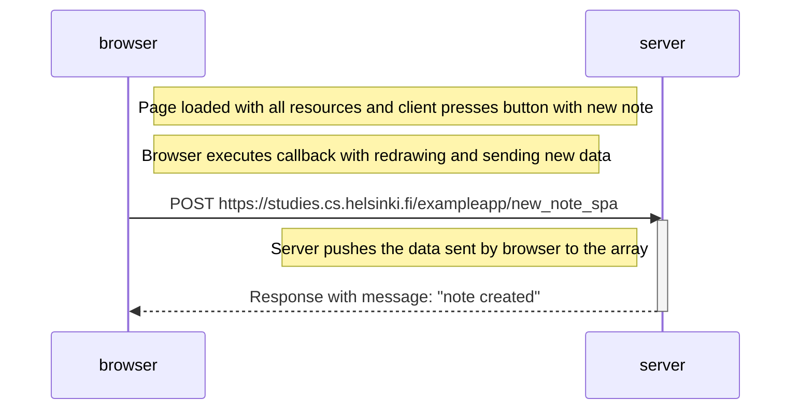

```mermaid

sequenceDiagram
    participant browser
    participant server

    Note right of browser: Page loaded with all resources and client presses button with new note
    Note right of browser: Browser executes callback with redrawing and sending new data
    browser->>server: POST https://studies.cs.helsinki.fi/exampleapp/new_note_spa
    activate server
    Note left of server: Server pushes the data sent by browser to the array
    server-->>browser: Response with message: "note created"
    deactivate server

```